# SPCRJointDynamics  
  
A bone physics engine for cloth.  
  
## Overview  
Do you want to simulate cloth in your game with physics? Then this is the plugin for you.  
SPCRJointDynamics requires a basic bone setup, and you are good to go.  
Support for Unity Engine 2018.2.0f1 and above.  
  
## License  
* [MIT License](./LICENSE)  
  
## Purpose of development  
  
There was a requirement in one of our games that the skirt of the character should perfectly interact with the character’s movement.  
  
## UE4 plugin  
Try Unreal engine 4 Plugin: https://github.com/SPARK-inc/SPCRJointDynamicsUE4  
  
## Specifications  
SPCRJointDynamics uses cross simulation algorithm (mass-spring-damper model) to animate the bones in real-time. For direct use for skirts and hairs, we mainly focused on the overall appearance rather than the physically accurate behaviors.  
Since adding bones is still a manual process in most 3D software, and therefore bones are not always correctly aligned. To overcome this issue, we made a constraint base plugin.  
  
## Each constraint.  
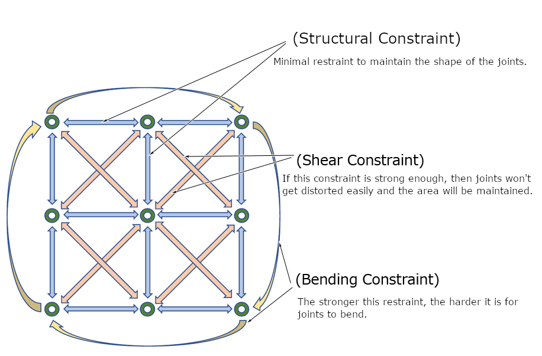  
  
## Advance Preparation  
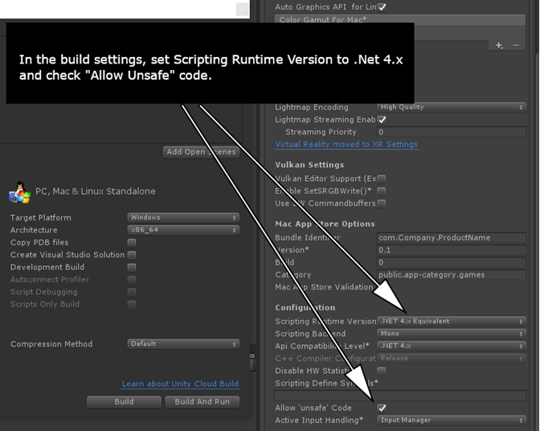  
Set scripting runtime version to .Net 4 and check the allow unsafe code.  
  
## How to use  
### When using the package manager
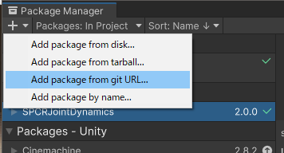  
URL:https://github.com/SPARK-inc/SPCRJointDynamics.git?path=unity/Packages/SPCRJointDynamics  
  
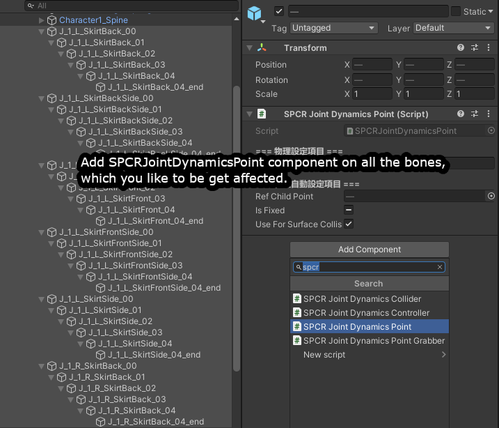  
Add SPCRJointDynamicsPoint component on all the child / hierarchical bones, which you would like to be get affected.  

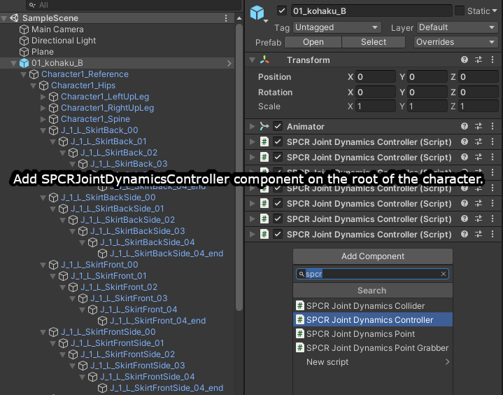  
Then add SPCRJointDynamicsController component on the root of the character.  
  
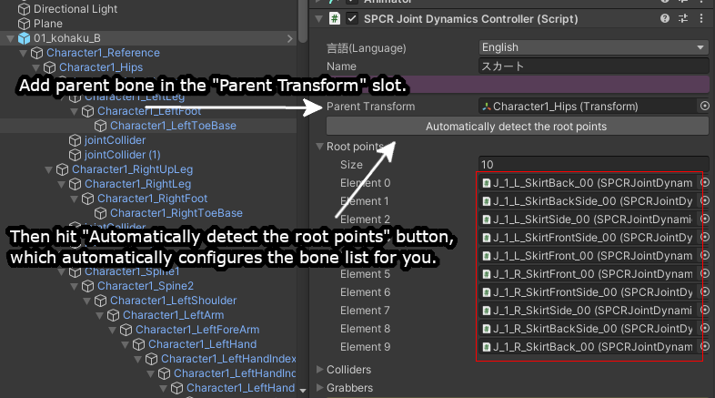  
Set the parent transform bone in the Parent Transform slot.  
Now press the [Automatically detect the root points] button, which automatically configures the child bone list, and adds the root bones to the Root Points list.   
(Which you can see in the red box in the above image)  

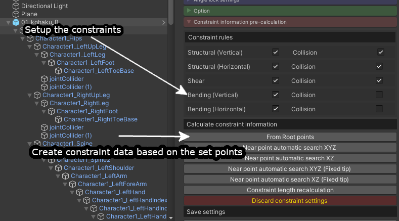  
In the [Constraints information pre-calculation] section, some predefined constraint presets are available to use.  
Here is a simple explanation of those constraints.  
  
**Structural vertical** → creates vertical bone constraints.  
**Structural horizontal** → creates horizontal bone constraints.  
**Shear** → Creates diagonal bone constraints.  
**Bending vertical** → This will create constraints with every alternate bone in the vertical list.  
 (Ex. ABC → Bending Vertical [A→C])  
**Bending Horizontal** → This will create constraints with every alternate bone in the horizontal list.  
(Ex. ABC → Bending Horizontal [A→C])  
  
**From Root Points** → Update/Apply selected preset.  
**Near point automatic search XYZ** → Rearrange the points by distance and updates/applies selected preset.  
**Near point automatic search XZ** → Rearrange the points by distance, ignoring the Y-axis, and update/apply selected preset.  
**Near point automatic search XYZ (Fixed UP)** → Rearrange the points by distance, the first and last bones are fixed. Then updates/applies selected preset.  
**Near point automatic search XZ (Fixed UP)** → Rearrange the points by distance by ignoring the Y-axis, the first and last bones are fixed. Then updates/applies selected preset.  
**Constraint length calculation** → Recalculates and updates the restraint length. This option is useful when you move the game object in the Hierarchy.  
  
## Adding a collider  
SPCRJointDynamics engine uses a special collider component to work with. Please note that this collider is different from Unity’s built-in collider.  
  
1.	Create a new game object in the scene.  
2.	Add SPCRJointDynamicsCollider component, by clicking on the Add Component button.  
  
  
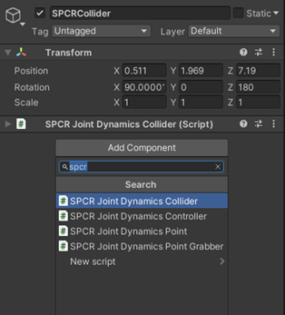  
  
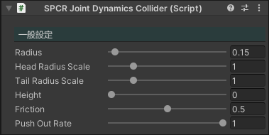  
  
There are two types of colliders SPCRJointDynamicsCollider is having, sphere collider and capsule collider.  
You can interchange the sphere collider with the capsule collider and vice versa by using the height of the collider.  
If the height is 0 then SPCRJointDynamics treats it as a sphere collider, and if the height is more than 0 then it will be treated as a capsule collider.  
  
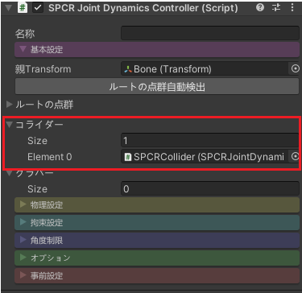  
Now select the main game object on which SPCRJointDynamicsController is attached, then add the collider in the collider array.  
  
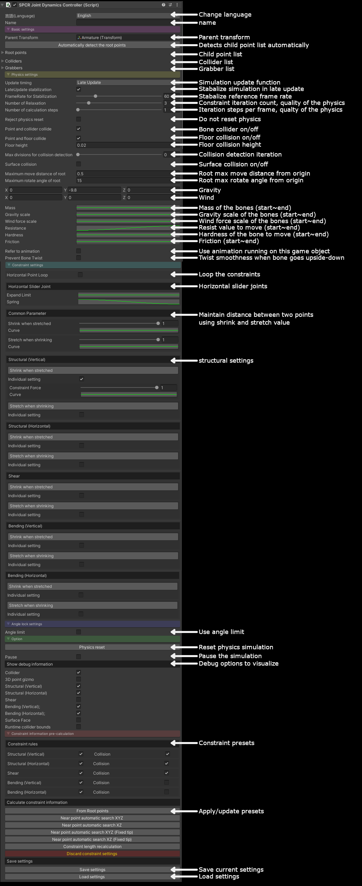  
  
Enjoy!!!  
Also, if you have some issues, feel free to add them in the issues section.  
