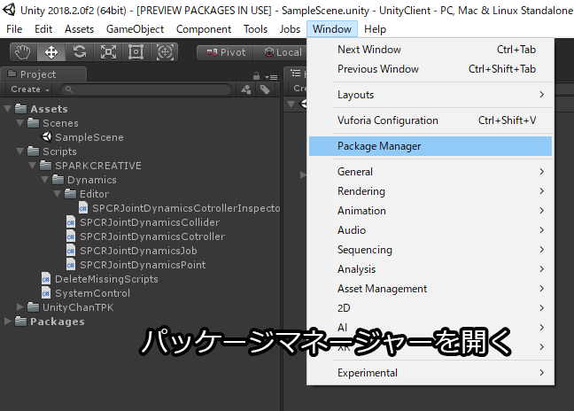
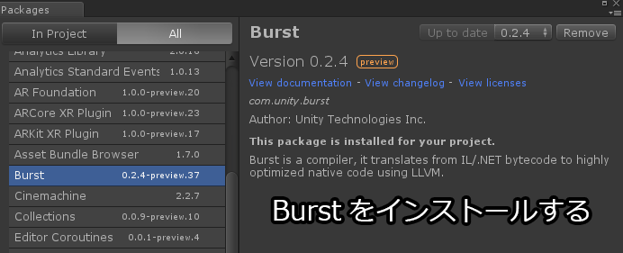
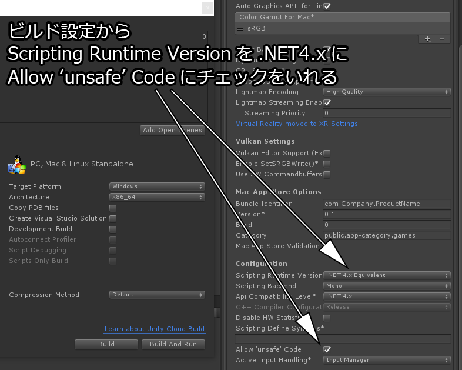
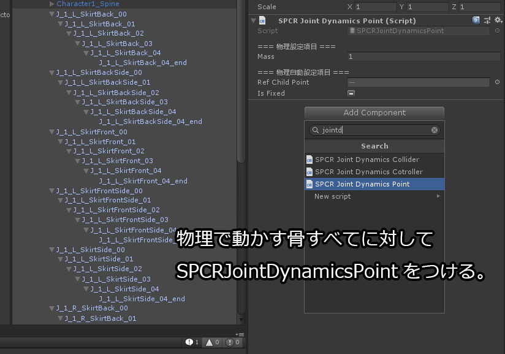
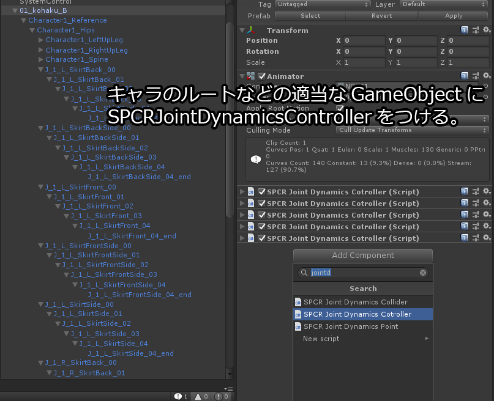
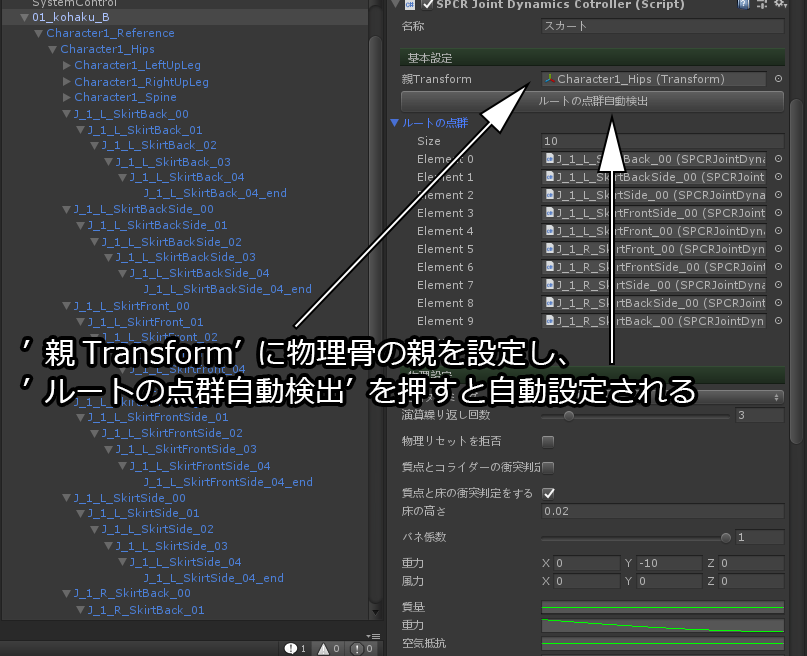
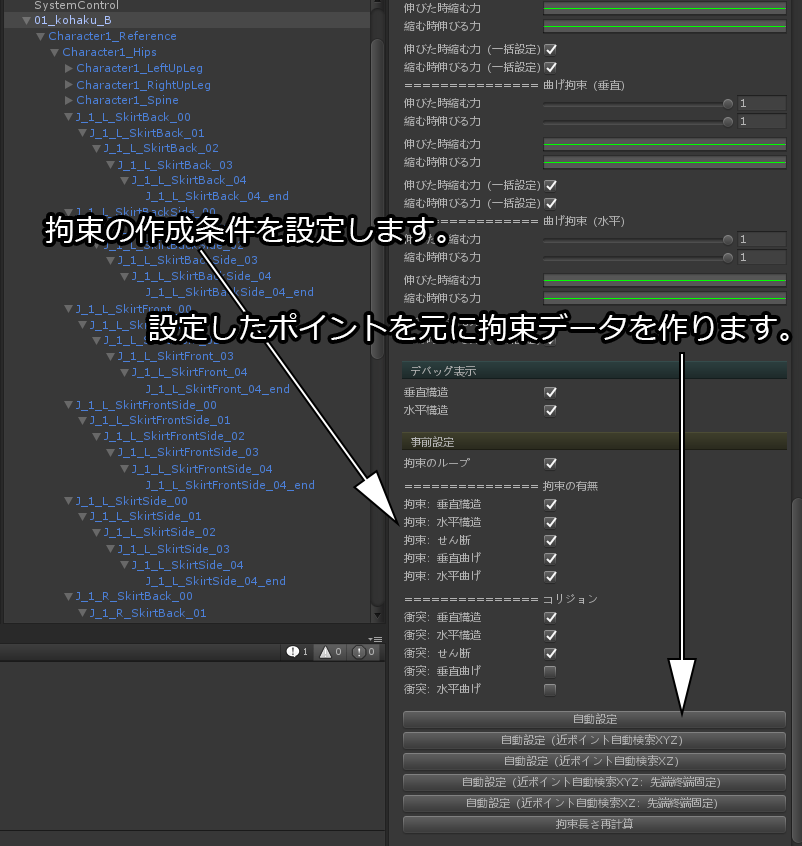
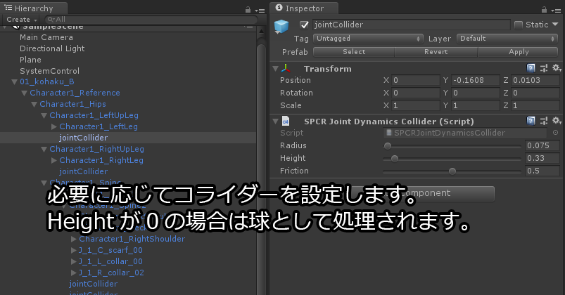
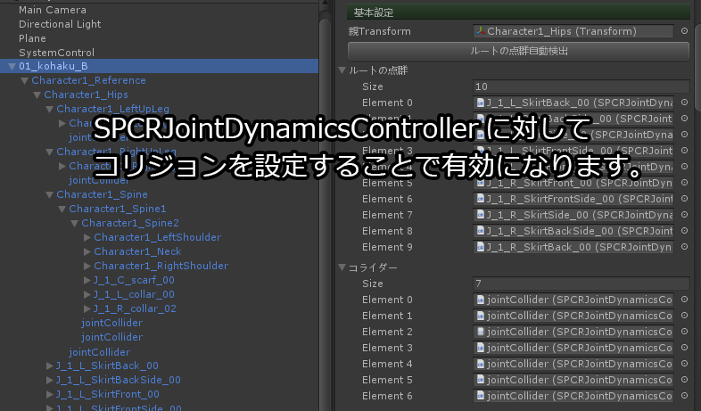
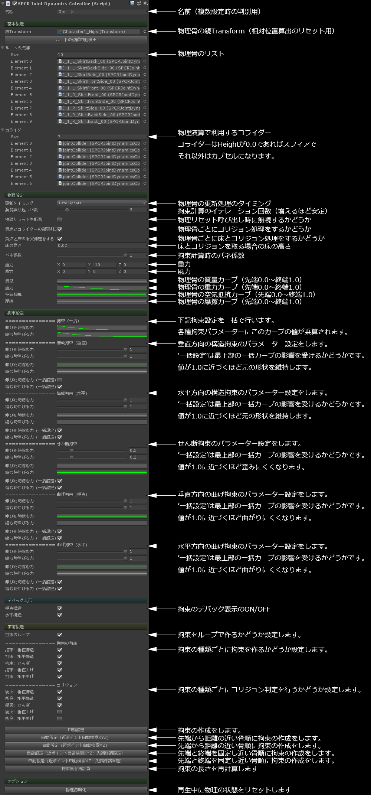

# SPCRJointDynamics
布風骨物理エンジン  

## 概要
骨間で布物理のようなシミュレーションを行うためのものです。  

* Unity2018.2.0f1にて動作確認  

## 開発目的
足がスカートを貫通するのを何とかして綺麗に広がるスカートを作ってみたい  
  

## 基本仕様
クロスシミュレーションのアルゴリズム（Mass-spring-damper model）をそのまま流用して骨を動かしています。  
スカートや髪の毛などで使いやすいように物理的な正しさとかよりも見た目のそれっぽさを優先して組んであります。  
骨が綺麗に並んでいるケースばかりではないので数がずれていても拘束を作りに行くようになっています。  
  
* 各拘束の意味
  

## 事前準備
  
まずはパッケージの設定をします。  
上部メニューから Window ⇒ Package Manager を選択しPackage Managerを開きます。  
  
  
AllからBurstを選択しInstallします。  
  
  
ビルド設定のプレイヤー設定から Scripting Runtime Versionを.Net4 以降にし  
Allow 'unsafe' Code のチェックを入れてunsafeコードが使えるようにします。  
  
## 使い方
  
物理骨として動かす骨に対して Add Compenent で SPCRJointDynamicsPoint をつけます。  
  
  
キャラのルートなどの適当なGameObjectに Add Compenent で SPCRJointDynamicsController をつけます。  
  
  
「親Transform」に初期姿勢を記録しておくための物理骨の親のTransformを設定します。  
物理リセットを行う際にはこの骨からみた相対的な姿勢に戻そうとします。  
  
「ルートの点群自動検出」ボタンを押すと親Transform以下のSPCRJointDynamicsPointが自動的に設定されます。  
  
  
下部にある「事前設定」の項目で骨に対する拘束を作成します。  
  
「拘束のループ」は骨同士の拘束処理のループを行うようになります。  
通常「ルートの点群」にABCDEという骨が指定してあった場合に「A-B, B-C, C-D, D-E」という拘束が作られます。  
このチェックが入っている場合は「A-B, B-C, C-D, D-E, E-A」という拘束が作られます。  
スカートのように円を描くように拘束する場合に使います。  
  
* 拘束の有無  
この項目はそれぞれの拘束を作るかどうかが設定できます。  
* コリジョン  
この項目ではそれぞれの拘束に対して当たり判定を行うかどうかを設定できます。  
  
* 自動設定  
「ルートの点群」に対して順番に拘束を構築していきます。  
  
* 自動設定（ポイント自動検索XYZ）  
「ルートの点群」に対して１つ目から距離の近い順番に並べ替えて拘束を構築していきます。  
  
* 自動設定（ポイント自動検索XZ）  
「ルートの点群」に対して１つ目からY軸を無視した距離の近い順番に並べ替えて拘束を構築していきます。  
  
* 自動設定（ポイント自動検索XYZ：先端終端固定）  
「ルートの点群」に対して最初と最後の骨を固定して距離の近い順番に並べ替えて拘束を構築していきます。  
  
* 自動設定（ポイント自動検索XZ：先端終端固定）  
「ルートの点群」に対して最初と最後の骨を固定してY軸を無視した距離の近い順番に並べ替えて拘束を構築していきます。  
  
* 拘束長さ再計算  
拘束がもつ骨どうしの長さを再計算します。  
Hierarchy上でGameObjectを動かして距離が変わった場合などに使います。  
  
  
コライダーは任意のGameObjectに対して Add Component で SPCRJointCollider をつけます。  
コライダーにはスフィアとカプセルがあり、Heightが0かどうかで判定しています。  
  
  
作成したコライダーは SPCRJointDynamicsController のコライダーの項目にセットすることで有効になります。  
  
## 各種パラメーターについて
  
  
## その他
Editor上で安定せずブルブル震えることがありますが  
Hierarchy上でキャラを選択している場合は未選択状態にする事で安定いたします。  
